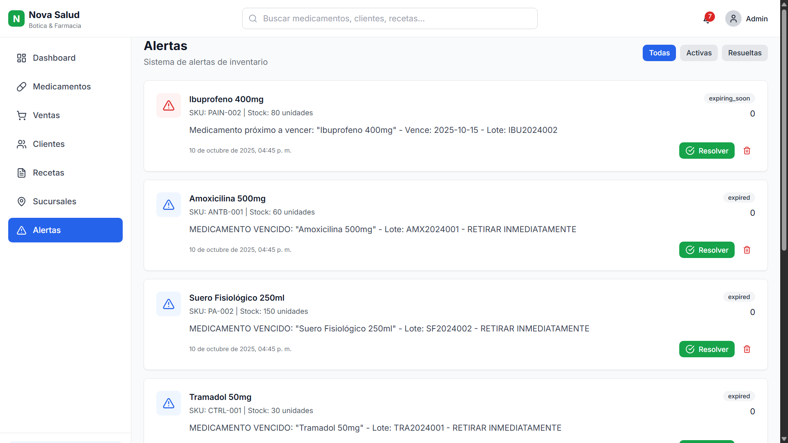

# Sistema de Gestión de Inventario - Botica Nova Salud

Sistema web especializado para la gestión integral de inventario farmacéutico, ventas, recetas médicas y atención al cliente con actualización en tiempo real, alertas automáticas de vencimiento y control de sustancias reguladas.


<!--  -->

## Tabla de Contenidos

- [Características](#características)
- [Tecnologías](#tecnologías)
- [Requisitos Previos](#requisitos-previos)
- [Instalación](#instalación)
- [Uso](#uso)
- [Estructura del Proyecto](#estructura-del-proyecto)
- [API Endpoints](#api-endpoints)
- [Vista Previa](#vista-previa)

## Características

### Funcionalidades Principales

- **Gestión de Medicamentos**: CRUD completo con fechas de vencimiento, lotes y principios activos
- **Control de Recetas Médicas**: Sistema completo de prescripciones y dispensación
- **Alertas Farmacéuticas**: Notificaciones de vencimiento, stock bajo y sustancias controladas
- **Registro de Ventas**: Historial completo con validación de recetas médicas
- **Gestión de Clientes**: Base de datos con historial médico y de compras
- **Sucursales y Ubicaciones**: Gestión de múltiples puntos de venta
- **Dashboard Farmacéutico**: Métricas específicas para boticas y farmacias
- **Reportes Regulatorios**: Reportes para DIGEMID y auditorías
- **Actualización en Tiempo Real**: WebSocket para cambios instantáneos
- **UI/UX Optimizada**: Diseño específico para atención rápida al cliente

### Características Técnicas

- **Backend**: Node.js + Express + MySQL
- **Frontend**: React 18 + Vite + TailwindCSS
- **Tiempo Real**: Socket.io para comunicación bidireccional
- **Gráficos**: Recharts para visualización de datos
- **Iconos**: Lucide React
- **Notificaciones**: React Hot Toast
- **Responsive**: Compatible con móviles, tablets y escritorio

## Tecnologías

### Backend
- **Node.js** v22.19.0
- **Express.js** ^4.18.2
- **MySQL2** ^3.6.5
- **Socket.io** ^4.6.0
- **dotenv** ^16.3.1
- **cors** ^2.8.5

### Frontend
- **React** ^18.2.0
- **React Router DOM** ^6.21.0
- **Axios** ^1.6.2
- **Socket.io-client** ^4.6.0
- **TailwindCSS** ^3.4.0
- **Lucide React** ^0.298.0
- **Recharts** ^2.10.3
- **React Hot Toast** ^2.4.1

### Base de Datos
- **MySQL** 8.0+

## Requisitos Previos

Antes de comenzar, asegúrate de tener instalado:

- **Node.js** v22.19.0 o superior
- **npm** v10.9.3 o superior
- **MySQL** 8.0 o superior
- **Git** (opcional)

### Verificar versiones instaladas:

```bash
node --version
npm --version
mysql --version
```

## Instalación

### 1. Clonar o descargar el proyecto

```bash
# Si usas Git
git clone https://github.com/BrunoFavianSM Entregable-Inventario.git
cd Entregable-Inventario

# O simplemente descarga y extrae el ZIP
```

### 2. Configurar Base de Datos

#### Paso 1: Crear la base de datos

Abre MySQL Workbench, phpMyAdmin o tu cliente MySQL preferido y ejecuta:

```sql
CREATE DATABASE IF NOT EXISTS nova_salud_inventario CHARACTER SET utf8mb4 COLLATE utf8mb4_unicode_ci;
```

#### Paso 2: Ejecutar scripts SQL

En orden, ejecuta los siguientes scripts ubicados en la carpeta `database/`:

```bash
# 1. Crear estructura de tablas
mysql -u root -p nova_salud_inventario < database/schema.sql

# 2. Insertar datos de prueba
mysql -u root -p nova_salud_inventario < database/seeds.sql

# 3. Crear procedimientos almacenados
mysql -u root -p nova_salud_inventario < database/procedures.sql
```

### 3. Instalar dependencias del Backend
Ejecute el siguiente comando para permitir la ejecución de scripts de PowerShell:

```bash
Set-ExecutionPolicy -Scope Process -ExecutionPolicy Bypass
```

```bash
cd server
npm install
```

### 4. Configurar variables de entorno del Backend

Crea un archivo `.env` en la carpeta `server/`:

```bash
# Copiar el archivo de ejemplo
copy .env.example .env
```

Edita el archivo `.env` con tus credenciales de MySQL:

```env
# Configuración del Servidor
PORT=5000
NODE_ENV=development

# Configuración de Base de Datos MySQL
DB_HOST=localhost
DB_PORT=3306
DB_USER=root
DB_PASSWORD=tu_contraseña_mysql
DB_NAME=nova_salud_inventario

# Configuración CORS
CORS_ORIGIN=http://localhost:5173

# Configuración de Socket.io
SOCKET_IO_PORT=5000
```

### 5. Instalar dependencias del Frontend

```bash
# Volver a la raíz del proyecto
cd ..
npm install
```

### 6. Configurar variables de entorno del Frontend

Crea un archivo `.env` en la raíz del proyecto:

```bash
# Copiar el archivo de ejemplo
copy .env.example .env
```

Edita el archivo `.env`:

```env
# URL del backend API
VITE_API_URL=http://localhost:5000/api
VITE_SOCKET_URL=http://localhost:5000
```

## Uso

### Iniciar el Backend

```bash
cd server
npm run dev
```

El servidor estará disponible en: `http://localhost:5000`

Deberías ver:

```
╔═══════════════════════════════════════════════════════════╗
║   SERVIDOR INICIADO CORRECTAMENTE                        ║
╠═══════════════════════════════════════════════════════════╣
║   API REST:        http://localhost:5000                 ║
║   Socket.io:       ws://localhost:5000                   ║
║   Entorno:         development                           ║
║   Base de Datos:   MySQL (nova_salud_inventario)         ║
╚═══════════════════════════════════════════════════════════╝
```

### Iniciar el Frontend

En otra terminal:

```bash
npm run dev
```

La aplicación estará disponible en: `http://localhost:5173`

### Acceder al Sistema

1. Abre tu navegador en `http://localhost:5173`
2. Explora las diferentes secciones:
   - **Dashboard**: Estadísticas y métricas farmacéuticas
   - **Medicamentos**: Gestión de inventario farmacéutico
   - **Ventas**: Registro de Ventas con validación de recetas
   - **Clientes**: Base de datos de pacientes y clientes
   - **Recetas**: Gestión de prescripciones médicas
   - **Sucursales**: Gestión de ubicaciones y puntos de venta
   - **Alertas**: Sistema de alertas de vencimiento y stock

## Estructura del Proyecto

```
gestion-inventario/
├── server/                         # Backend
│   ├── config/database.js          # Configuración MySQL
│   ├── controllers/                # Lógica de negocio
│   ├── models/                     # Modelos de datos
│   ├── routes/                     # Rutas de API
│   ├── middleware/                 # Middlewares
│   ├── socket/                     # Socket.io handlers
│   ├── .env                        # Variables de entorno
│   ├── package.json                # Dependencias backend
│   └── server.js                   # Servidor principal
│
├── database/                       # Scripts SQL
│   ├── schema.sql                  # Estructura de tablas
│   ├── seeds.sql                   # Datos de prueba
│   └── procedures.sql              # Procedimientos almacenados
│
├── src/                            # Frontend
│   ├── components/                 # Componentes React
│   │   ├── layout/                 # Layout components
│   │   ├── dashboard/              # Dashboard components
│   │   └── ui/                     # UI components
│   ├── pages/                      # Páginas principales
│   ├── services/                   # API y Socket services
│   ├── styles/                     # Estilos globales
│   ├── App.jsx                     # Componente principal
│   └── main.jsx                    # Punto de entrada
│
├── .env                            # Variables de entorno frontend
├── package.json                    # Dependencias frontend
├── tailwind.config.js              # Configuración Tailwind
├── vite.config.js                  # Configuración Vite
└── README.md                       # Documentación
```

## API Endpoints

### Productos
- `GET /api/products` - Listar todos los productos
- `GET /api/products/:id` - Obtener producto por ID
- `GET /api/products/search?q=query` - Buscar productos
- `GET /api/products/low-stock` - Productos con stock bajo
- `POST /api/products` - Crear producto
- `PUT /api/products/:id` - Actualizar producto
- `PATCH /api/products/:id/stock` - Actualizar stock
- `DELETE /api/products/:id` - Eliminar producto

### Ventas
- `GET /api/sales` - Listar ventas
- `GET /api/sales/:id` - Obtener venta por ID
- `GET /api/sales/stats` - Estadísticas de ventas
- `GET /api/sales/top-products` - Productos más vendidos
- `POST /api/sales` - Crear venta

### Clientes
- `GET /api/customers` - Listar clientes
- `GET /api/customers/:id` - Obtener cliente por ID
- `GET /api/customers/search?q=query` - Buscar clientes
- `POST /api/customers` - Crear cliente
- `PUT /api/customers/:id` - Actualizar cliente
- `DELETE /api/customers/:id` - Eliminar cliente

### Recetas Médicas
- `GET /api/prescriptions` - Listar recetas
- `GET /api/prescriptions/:id` - Obtener receta por ID
- `GET /api/prescriptions/pending` - Recetas pendientes
- `GET /api/prescriptions/expiring` - Recetas por vencer
- `POST /api/prescriptions` - Crear receta
- `PATCH /api/prescriptions/:id/dispense` - Dispensar medicamento
- `PUT /api/prescriptions/:id` - Actualizar receta

### Alertas
- `GET /api/alerts` - Listar todas las alertas
- `GET /api/alerts/active` - Alertas activas
- `PATCH /api/alerts/:id/resolve` - Resolver alerta
- `DELETE /api/alerts/:id` - Eliminar alerta

### Ubicaciones
- `GET /api/locations` - Listar ubicaciones
- `GET /api/locations/:id` - Obtener ubicación por ID
- `GET /api/locations/nearby?latitude=X&longitude=Y` - Ubicaciones cercanas
- `POST /api/locations` - Crear ubicación
- `PUT /api/locations/:id` - Actualizar ubicación
- `DELETE /api/locations/:id` - Eliminar ubicación

### Dashboard
- `GET /api/dashboard` - Estadísticas del dashboard

## Vista previa

### Dashboard

### Medicamentos

### Ventas

### Clientes

### Recetas

### Sucursales

### Alertas



## Comandos Útiles

### Permisos para ejecutar scripts de PowerShell

```bash
Set-ExecutionPolicy -Scope Process -ExecutionPolicy Bypass
```

### Backend
```bash
cd server
npm start        # Iniciar en producción
npm run dev      # Iniciar en desarrollo (con nodemon)
```

### Frontend
```bash
npm run dev      # Iniciar servidor de desarrollo
npm run build    # Construir para producción
npm run preview  # Previsualizar build de producción
```

## Solución de Problemas

### Error de conexión a MySQL

```
Error al conectar con MySQL
```

**Solución**: Verifica las credenciales en `server/.env`:
- Usuario correcto
- Contraseña correcta
- Base de datos creada
- MySQL ejecutándose

### Puerto ya en uso

```
Error: listen EADDRINUSE: address already in use :::5000
```

**Solución**: Cambia el puerto en `server/.env` o detén el proceso que usa el puerto 5000:

```bash
# Windows
netstat -ano | findstr :5000
taskkill /PID <PID> /F

# Linux/Mac
lsof -i :5000
kill -9 <PID>
```

### Errores de dependencias

```bash
# Limpiar caché y reinstalar
npm cache clean --force
rm -rf node_modules package-lock.json
npm install
```

## Datos de Prueba

El sistema incluye datos de prueba específicos para farmacia:
- 13 medicamentos con información farmacéutica completa
- 8 clientes/pacientes de ejemplo
- 6 sucursales farmacéuticas con coordenadas GPS
- 5 proveedores farmacéuticos especializados
- 3 recetas médicas de ejemplo
- Configuración específica para Nova Salud

## Contribuir

1. Fork el proyecto
2. Crea una rama para tu feature (`git checkout -b feature/AmazingFeature`)
3. Commit tus cambios (`git commit -m 'Add some AmazingFeature'`)
4. Push a la rama (`git push origin feature/AmazingFeature`)
5. Abre un Pull Request


---

**Sistema de Gestión de Inventario - Botica Nova Salud**
**Desarrollado por: Bruno Saldarriaga ヾ(⌐■_■)ノ♪**  